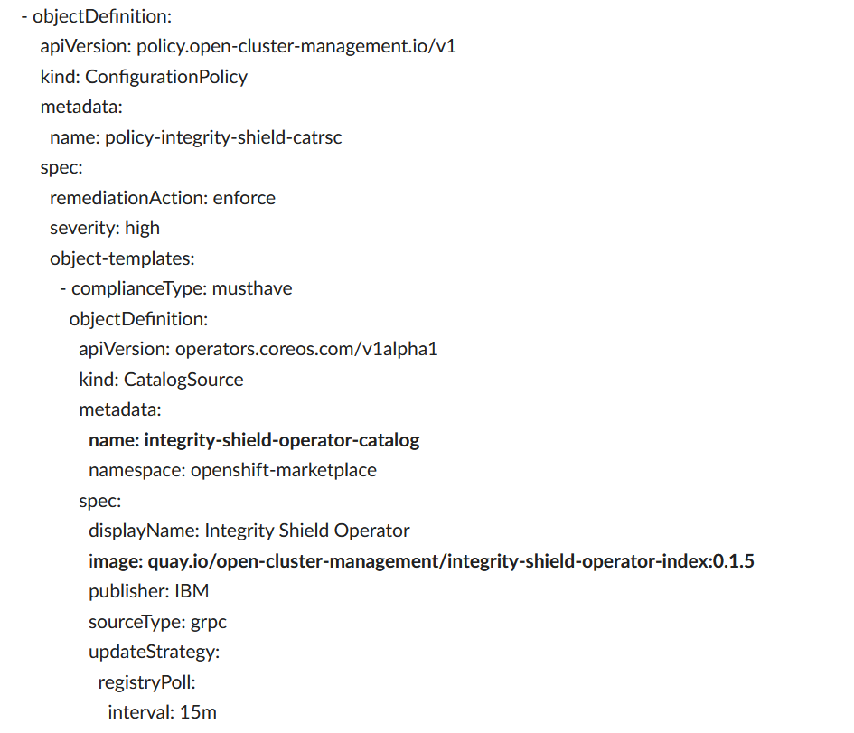
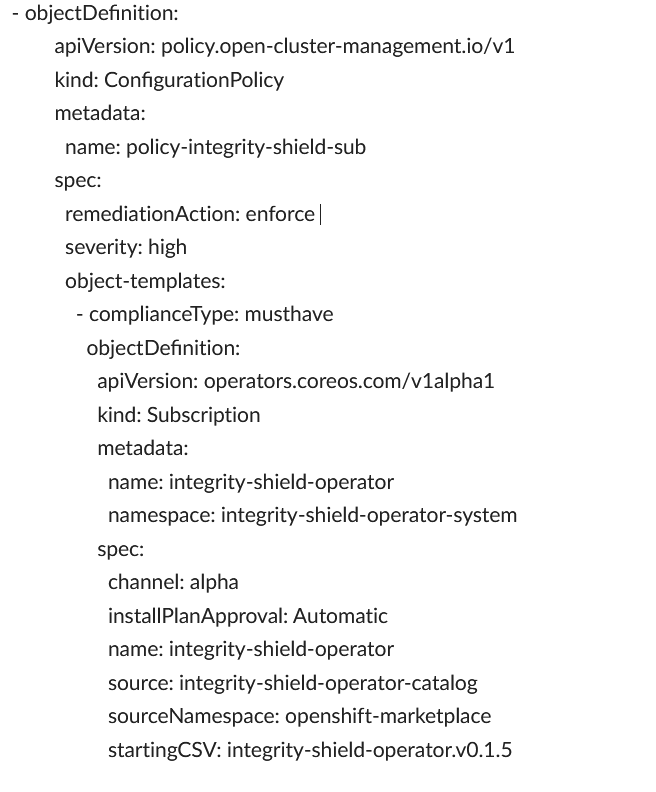

# Test Integrity Shield with RHACM

## Prerequisite:

## Action Steps:

 1. Git clone your forked repository for : https://github.com/open-cluster-management/policy-collection
 
 2. Edit the policy file community/CM-Configuration-Management/policy-integrity-shield.yaml

 3. Add the following ConfigurationPolicy to policy-integrity-shield.yaml, under policy-templates:
    
    - change version in image: (quay.io/open-cluster-management/integrity-shield-operator-index:0.1.5)
    
       
    
    
    
    - Change the following ConfigurationPolicy in policy-integrity-shield.yaml, 
    
      Update the following fields:
         source: integrity-shield-operator-catalog   <should be same as the CatalogSource name used in the policy>
         startingCSV: integrity-shield-operator.v0.1.5  <update version based on latest version>
              
      The following is an example after the changes.
      
      
      
 4. Commit the changes to policy and test policy as described in [doc](https://github.ibm.com/integrity-shield/integrity-shield-testscenarios/blob/fix/install-scenarios/TEST_QUICK_README.md   )
