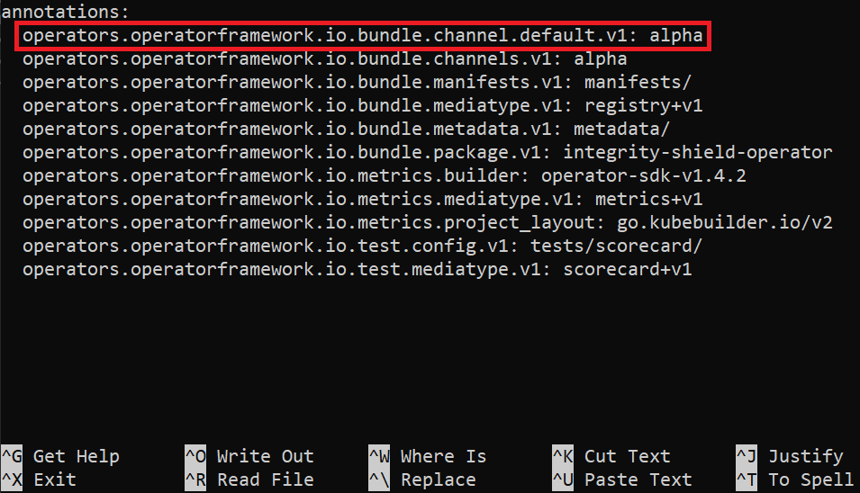

# Update Integrity Shield operator  submitted at operatorhub 

## Prerequisite:
   1. Complete the steps to update version of Integrity Shield and test the operator locally with OLM on a Kind clusters described [here]()
   2. Complete the steps to test Integrity Shield protection using ACM Polices with images from Quay repository as described [here]()
   
## Steps

1. Fork the community operators Git repository: `https://github.com/operator-framework/community-operators`

2. Clone your forked repository in your host machine e:g: https://github.com/gajananan/community-operators

3. Check the current ISHIELD_VERSION (e.g. ISHIELD_VERSION=0.1.7 ) in your local Integrity Shield directory where you updated version.

4. Go to your local directory of cloned repository of community operators

   ```
   cd community-operators/community-operators/integrity-shield-operator
   ls
   0.1.3  0.1.4  0.1.5  0.1.6  ci.yaml
   ```
5. Create a new directory under the director `community-operators/community-operators/integrity-shield-operator`
  
   ```
   mkdir 0.1.7
   ```
6. Copy the update operator bundle content from Integrity Shield directory 
   
   ```
   cp -r <Integrity Shield Root Directory>/integrity-shield-operator/bundle/manifest 0.1.7/manifest
   cp -r <Integrity Shield Root Directory>/integrity-shield-operator/bundle/metadata 0.1.7/metadata
   ```
7. Update the annotation.yaml
  
   ```
   cd metadata
   nano annotation.yaml
   ```
  
   Add `operators.operatorframework.io.bundle.channel.default.v1: alpha`  as shown below and save the file.
   
   
   
   
   
8. Repeat the same steps from 4 - 7 for submitting Integrity Shield under `upstream-community-operators` 
   
